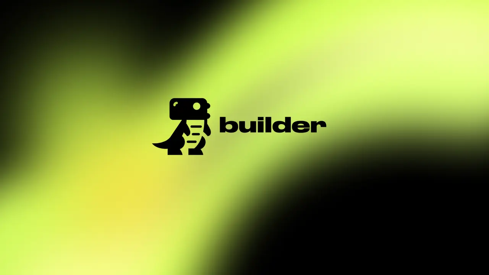

# Dino Builder — AR Ecommerce App Builder



[](https://reactjs.org/)
[](https://developer.mozilla.org/en-US/docs/Web/JavaScript)
[](https://tailwindcss.com/)
[](https://sass-lang.com/)
[](https://firebase.google.com/)

Dino Builder 🦖 is an Augmented Reality (AR) Ecommerce App Builder that enables you to create e-commerce applications with integrated AR products. With Dino Builder, you can provide a unique shopping experience for your customers by allowing them to visualize products in their physical environment through AR technology.

## Features ✨
- **AR Product Integration:** Seamlessly integrate AR products into your e-commerce app, allowing users to interact with products in their real-world surroundings.
- **Customization:** Customize the look and feel of your app, ensuring your app aligns with your brand identity.
- **Cross-Platform Compatibility:** Ensuring cross-platform compatibility for both iOS and Android.

## Installation 🛠️
1. Clone the repository:
   ```bash
   git clone https://github.com/seifeldinio/dino-builder-demo.git
   ```
2. Navigate to the project directory:
   ```bash
   cd dino-builder
   ```
3. Install dependencies:
   ```bash
   npm install
   ```
4. Start the development server:
   ```bash
   npm start
   ```
5. Open your browser and visit [http://localhost:3000](http://localhost:3000) to view the app.

## Usage 🙌
- **Development:** Modify the source code in the `src` directory to customize the app according to your requirements.
- **Production:** Build the app for production using `npm run build`, and deploy the generated `build` folder to your hosting platform.

## Contributing 🤝
Contributions are welcome! Please feel free to submit issues and pull requests.
